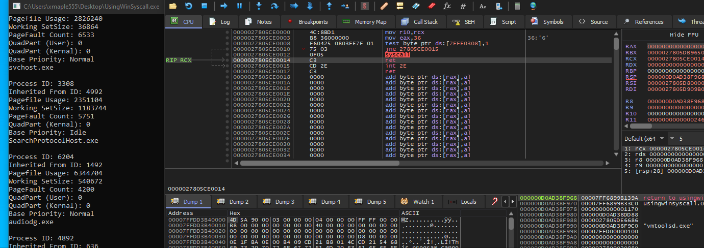
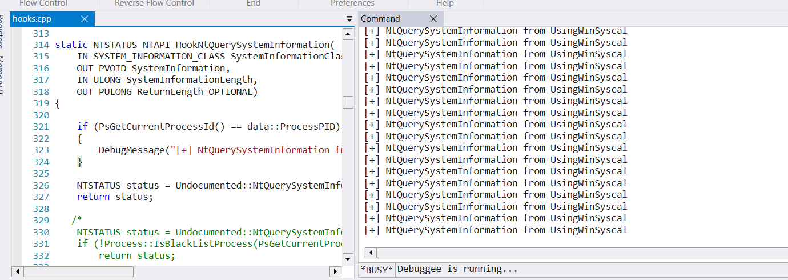
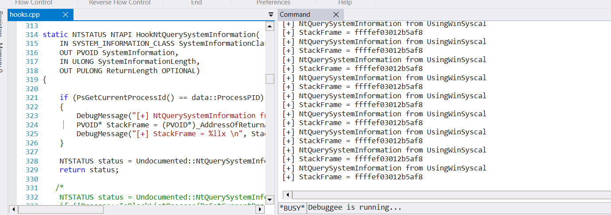
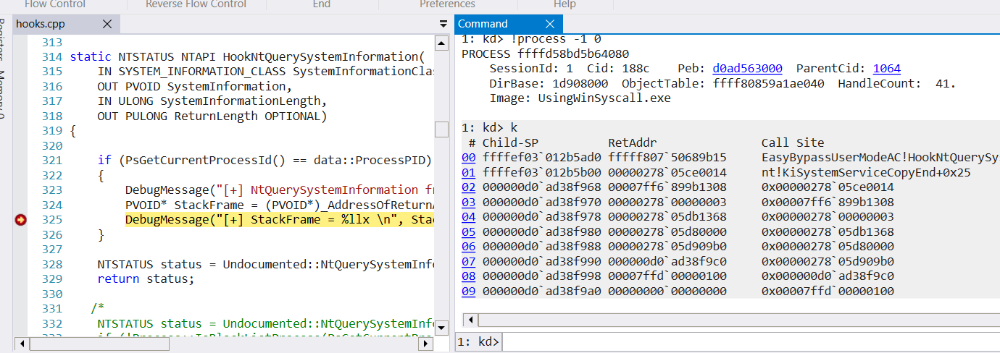
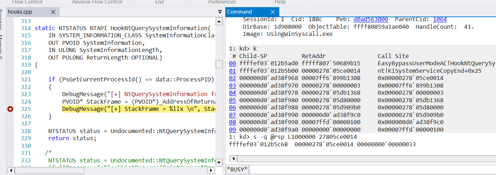
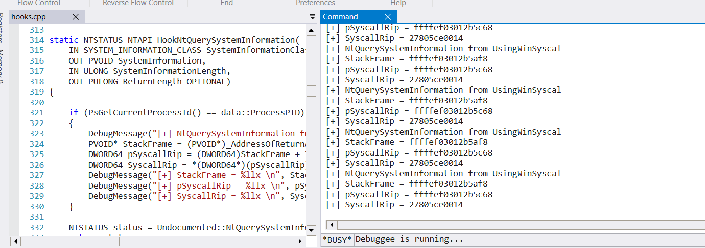

# FindSyscallRip
[UsingWinSyscall](https://github.com/xmaple555/UsingWinSyscall) demonstrates how to call Windows syscalls without getting the ntapi's address. Sometimes the program may be highly packed, so it is almost impossible to find out what syscall the program uses via static and dynamic analyses. Unlike Linux, Windows doesn't have any tools to trace syscalls, so we need to use Windows kernel drivers and Windbg to access Windows kernel to figure out. Here we will hook SSDT to find out what syscall has been used and where it is called in user-mode program.

# Demo
## UsingWinSyscall
Before we do anything, we need to know what address UsingWinSyscall call NtQuerySystemInformation at. Because UsingWinSyscall use VirtualAlloc to allocate the syscall memory, we need to find the adress via dynamic analysis.



According to the picture, we can know that the address of the syscall is 27805ce0014, and the value of the rip after NtQuerySystemInformation should be 27805ce0014. Since we know that the syscall will store the user-mode information in the kernel-mode memory to do context switch, we can find out what address holds the value of the user-mode rip in the kernel. After getting the rip value, we can easily know what address the syscall is at.



```c
if (PsGetCurrentProcessId() == data::ProcessPID)
    {
        DebugMessage("[+] NtQuerySystemInformation from %s\n", Misc::PsGetProcessImageFileName2(PsGetCurrentProcess()));                         
    }
```
First, we hook NtQuerySystemInformation and compare the current PID. The purpose here is to monitor the syscall the specified process has called, and we can set a conditional breakpoint in Windbg to get hit when the process calls NtQuerySystemInformation.



```c
if (PsGetCurrentProcessId() == data::ProcessPID)
    {
        DebugMessage("[+] NtQuerySystemInformation from %s\n", Misc::PsGetProcessImageFileName2(PsGetCurrentProcess()));                         
        PVOID* StackFrame = (PVOID*)_AddressOfReturnAddress();
        DebugMessage("[+] StackFrame = %llx \n", StackFrame);
    }
```
Proceeding that, we use `_AddressOfReturnAddress()` to get the pointer that points the return address of HookNtQuerySystemInformation. The purpose is to get one address in the stack frame because MSVC compiler doesn't support inline asm code in the x64 architecture to get the rip directly. As the picutre, we know that the address is 0xffffef03012b5af8.



To know what address the value of the user-mode rip is in the kernel, we use the backtrace command `k` to list the return addresses. As we can see, the return address of KiSystemServiceCopyEnd+0x25 is 00000027805ce0014, the address of the user-mode rip. 



Proceeding that, we use the search pattern command `s -q @rsp L1000000 27805ce0014` to find out what address holds the value. It should be noted here that the second row of Child-SP ffffef03012b5b00 doesn't hold the address of the user-mode rip. After this, we know that the address ffffef03012b5c68 has the value 00000027805ce0014. This gives us the byte offset `0xffffef03012b5c68 -0xffffef03012b5af8 = 368`.



```c
if (PsGetCurrentProcessId() == data::ProcessPID)
    {
        DebugMessage("[+] NtQuerySystemInformation from %s\n", Misc::PsGetProcessImageFileName2(PsGetCurrentProcess()));                         
        PVOID* StackFrame = (PVOID*)_AddressOfReturnAddress();
        DWORD64 pSyscallRip = (DWORD64)StackFrame + 368;
        DWORD64 SyscallRip = *(DWORD64*)(pSyscallRip);
        DebugMessage("[+] StackFrame = %llx \n", StackFrame);
        DebugMessage("[+] pSyscallRip = %llx \n", pSyscallRip);
        DebugMessage("[+] SyscallRip = %llx \n", SyscallRip);
    }
```

Finally, we use the rip address of HookNtQuerySystemInformation and the byte offset to know what address has the value of the user-mode rip. It is noteworthy that the offset is case-by-case: Different Windows OS version, syscalls and kernel driver code will cause the different offset. Therefore, it should be repeted yourself.
